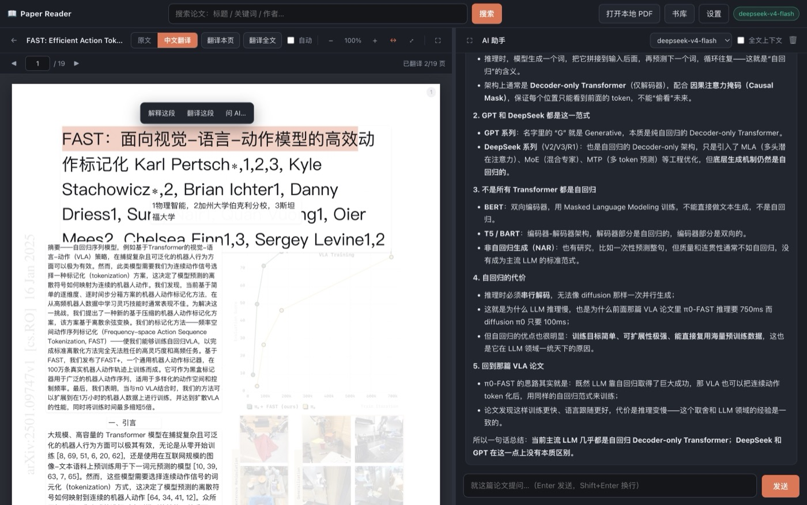

# Paper Reader · 论文阅读器

左论文、右 AI 的双栏阅读器：本地 PDF / arXiv 检索 → 中英对照阅读 → 选中即问。



左侧是服务端渲染的页面，叠了一层逐词对齐的透明文本层，所以可以像原生 PDF 一样拖动
选中；右侧是对话区，选中的文字会作为引用进到提问里。

---

## 快速开始

```bash
python3 agent/boot.py
```

不需要建虚拟环境、不需要手动 `pip install`、不需要改配置、不需要第二条命令。
`agent` 会按顺序做四件事：

| 步骤 | 做什么 | 失败时 |
| --- | --- | --- |
| 1 | 检查 Python ≥ 3.9 与 pip 是否可用 | 打印装 pip 的命令 |
| 2 | 检查 `requirements.txt`，缺什么装什么（`pip install --user`，依次尝试阿里云 → 清华 → 官方源） | 报错并指出缺哪个包 |
| 3 | **真连一次**大模型接口来探测可用配置，写入 `data/settings.json` | 不阻断启动，阅读/检索仍可用，界面里再配 |
| 4 | 选空闲端口启动服务并打开浏览器 | — |

依赖就装在你跑脚本的那个解释器里（非虚拟环境时加 `--user`，落在
`~/Library/Python/3.x/lib/python/site-packages`，不碰系统目录、不需要 sudo）。
要卸掉：`python3 -m pip uninstall fastapi uvicorn httpx PyMuPDF python-multipart`。

常用参数：`--port 8765`、`--host`、`--no-browser`、`--check`（只检测不启动）、`--recheck-api`。

---

## 环境要求

- **Python 3.9+**。代码刻意避开了 3.10+ 语法（不用 `X | Y`、`match`、`asyncio.TaskGroup`），
  因为 macOS 自带的 `/usr/bin/python3` 就是 3.9.6，装个 Python 才能跑太劝退了。
- **macOS / Linux**。Windows 未测试。
- **一个大模型接口**，三选一即可：Anthropic 兼容网关（含 Claude Code CLI 的配置）、
  环境变量里给好的 `ANTHROPIC_*`、或本地 ollama / vLLM。探测顺序见下节。

依赖只有 5 个：FastAPI、uvicorn、httpx、PyMuPDF、python-multipart，`agent/deps.py` 会自动装。

---

## 功能

**阅读**
- 打开本地 PDF（选择文件 / 拖拽 / 粘贴绝对路径）
- 按标题、关键词、作者检索 **arXiv** 与 **Semantic Scholar**，一键下载入库（下载走 SSE 报进度）
- 服务端渲染页面为图片，叠加逐词对齐的透明文本层 —— 可以像原生 PDF 一样**拖动选中**文字
- 翻页（按钮 / 页码输入 / ← → / PageUp PageDown）、缩放、适应宽度 / 适应整页
- 页面尺寸在打开时一次性取回，整篇布局稳定，翻页不跳动
- 扫描件（无文本层）会被识别并提示，不会假装能翻译

**翻译**
- 「原文 / 中文翻译」一键切换
- 按**段落**为单位翻译，页内并发，结果流式回填，已读页面自动翻译（可关）
- 译文以白底块覆盖在原位置，原页淡化为底图，图表位置仍可见
- 译文本身也可以选中、复制、提问
- 翻译结果按内容哈希缓存到 `data/papers/<id>/translation.json`，重复阅读零成本
- 「翻译全文」会串行翻完整篇，可随时中断，已完成的部分保留

**AI 对话**
- 普通问答：自动带上论文标题、摘要、当前页文本
- **选中即问**：选中左侧文字 → 浮动菜单「解释这段 / 翻译这段 / 问 AI…」→
  选中内容作为引用进入对话并高亮显示
- 复制选区时会把逐词文本重组成干净句子（不会得到一堆碎词）
- 折叠思考过程、流式输出、Markdown / 表格 / 代码块渲染
- 可选「全文上下文」开关；对话历史按论文持久化

**界面**
- 左右双栏，中间可拖动分隔（宽度记在 localStorage）
- 任一侧可**全屏折叠另一侧**（论文区的 `⛶` / 对话区的 `⛶`，或 `F` / `f`）
- `Esc` 退出全屏或关闭弹窗

**历史记录**
- 书库首页展示全部读过的论文：封面缩略图、标题、作者、出处、已读进度
- 点击继续阅读，自动回到上次的页码
- 支持按标题/作者/摘要过滤、从书库移除（连带清掉 PDF 与翻译缓存）

---

## 大模型配置

默认走 **Anthropic 兼容协议**，与本机 Claude Code CLI 用的是同一套配置。探测顺序：

1. `data/settings.json`（界面上保存过的）
2. 环境变量 `ANTHROPIC_BASE_URL` / `ANTHROPIC_AUTH_TOKEN` / `ANTHROPIC_API_KEY` / `ANTHROPIC_MODEL`
3. `~/.claude/settings.json` 的 `env` 段（Claude Code CLI 的配置）
4. 本地运行时：ollama `:11434`、LM Studio `:1234`、vLLM `:8000` 等

每个候选都会**发一次真实请求验证**，能通的才采用。

也可以在界面右上角「设置」里改 Base URL、密钥、模型、协议，并点「测试连接」。
本地 ollama / vLLM 请把协议切到 **OpenAI 兼容**。

翻译请求会带上 `thinking: {"type": "disabled"}` 以提速；公共 Anthropic API 不接受该字段时，
在设置里取消勾选「使用 thinking 开关」即可。

---

## 目录结构

```
agent/      内置 agent：boot.py（入口）· detect.py（API 探测）· deps.py（依赖安装）
server/     FastAPI 后端
  ├ main.py       HTTP 路由
  ├ pdf.py        PyMuPDF：渲染页面、逐词文本层、段落切分、标题识别
  ├ llm.py        Anthropic / OpenAI 双协议的流式客户端
  ├ translate.py  段落级并发翻译 + 内容哈希缓存
  ├ search.py     arXiv + Semantic Scholar 检索与下载
  └ library.py    SQLite 书库与对话历史
web/        前端（原生 JS，无构建步骤）
docs/       README 用图
data/       运行时数据（已 gitignore）
```

改后端重启即可；前端没有构建步骤，刷新浏览器就行。

## 接口速查

```
GET  /api/health                              服务与大模型状态
GET  /api/papers                              书库列表（?q= 过滤）
POST /api/papers/upload                       上传本地 PDF
POST /api/papers/open-local                   按绝对路径打开
GET  /api/search?q=&source=                   arXiv / Semantic Scholar 检索
POST /api/papers/open-result/stream           下载并入库（SSE 进度）
GET  /api/papers/{id}/pages                   全部页面尺寸
GET  /api/papers/{id}/pages/{n}.png           页面图片
GET  /api/papers/{id}/pages/{n}/layout        逐词文本层 + 段落块
GET  /api/papers/{id}/pages/{n}/translate     翻译该页（SSE）
POST /api/chat/stream                         对话（SSE）
POST /api/papers/{id}/progress                记录阅读位置
```

---

## 安全边界

这是个**本机单用户工具**，没有账号体系，请按这个前提使用：

- 服务默认只监听 `127.0.0.1`，不对局域网开放。
- **但 CORS 目前是 `allow_origins=["*"]`** —— 意味着你在浏览器里打开的**任意网页**都能
  请求本机的这个服务：读你的书库和对话、发起对话消耗你的 token，`open-local` 甚至允许
  把本机任意 PDF 读进书库再下载走。要在不完全信任的环境里跑，先把 `server/main.py`
  里的 `allow_origins` 收紧成 `["http://127.0.0.1:8765"]`。
- API key 明文存在 `data/settings.json`。`data/` 已 gitignore，**不要把它打包分享**。

## 已知限制

- **默认上下文是「当前页 + 摘要」，不是全文。** 问整篇性的问题（比如"这篇相比前作改了什么"）
  时答案会受限于当前页，需要勾选对话区工具栏的「全文上下文」。关掉是为了省 token 和延迟，
  但代价是这类问题第一次往往答不好。
- 扫描件没有文本层，不能翻译、不能按文本检索。
- 翻译质量取决于模型；译文按内容哈希缓存，**改翻译提示词不会让缓存失效**，要
  `?force=true` 或删掉 `translation.json`。
- 中文译文层没有词级坐标，所以译文里的选区只能按段落粒度对齐。
